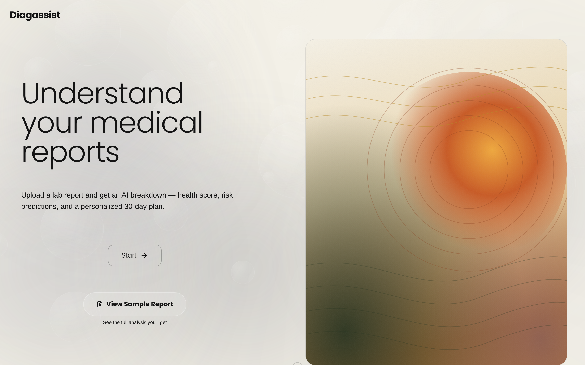
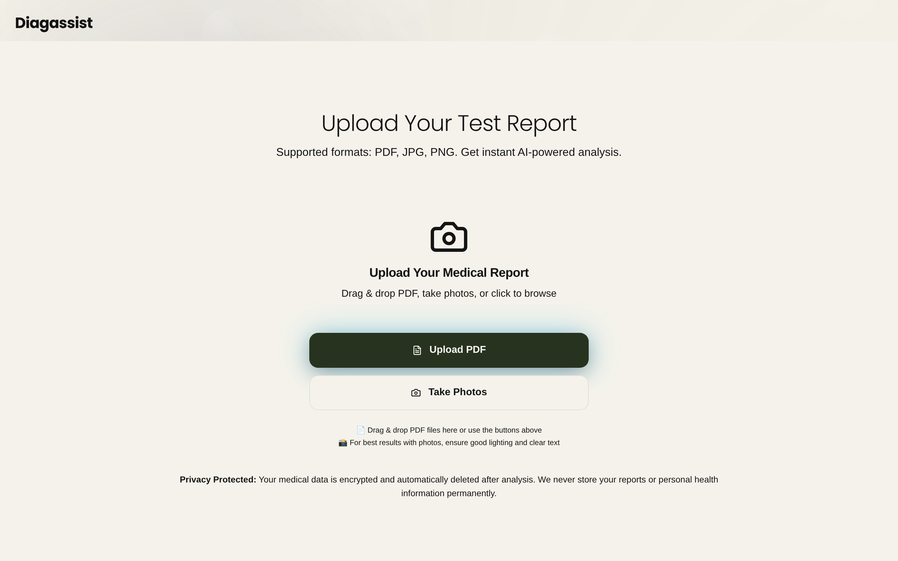
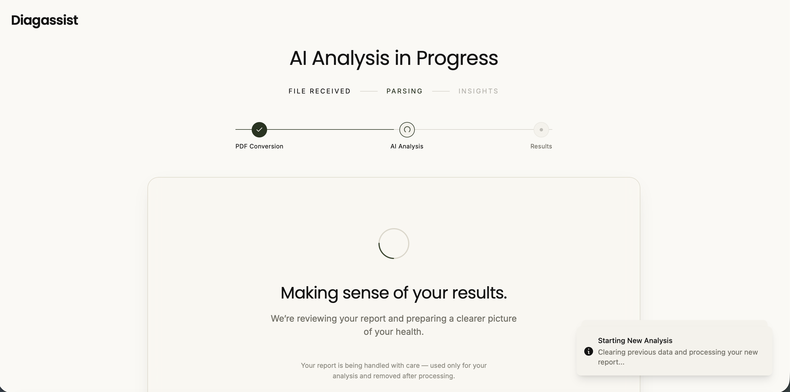
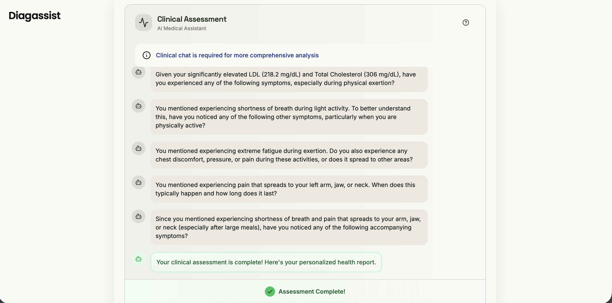
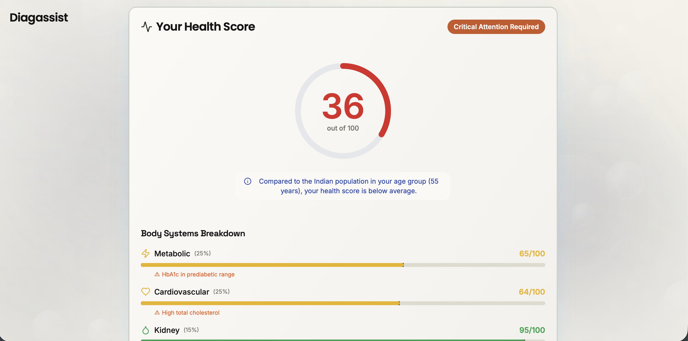
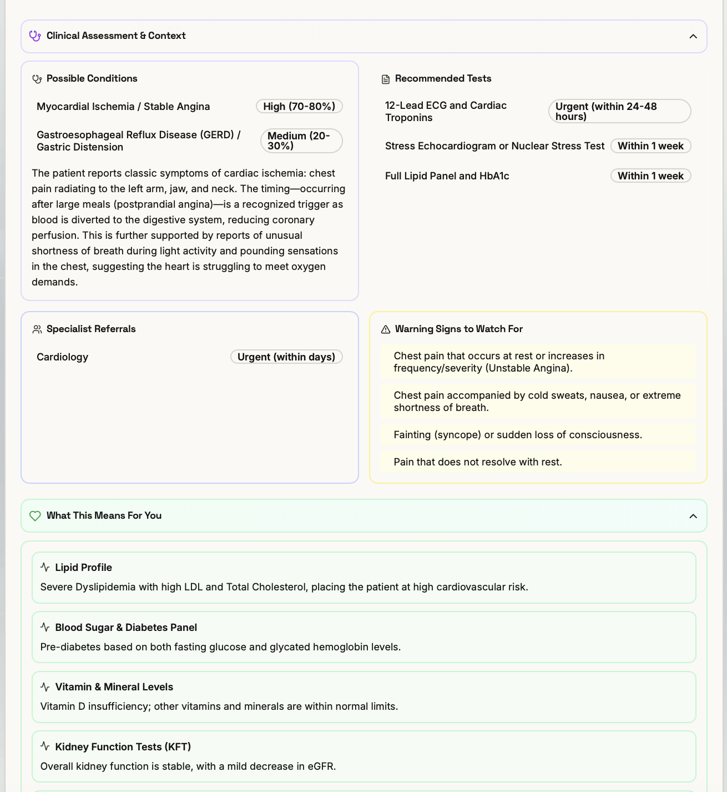
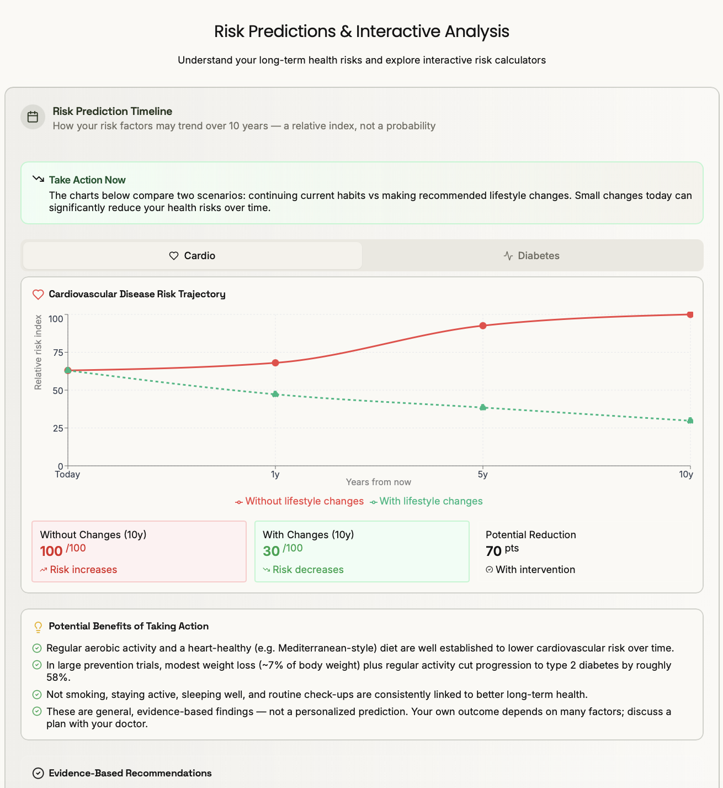
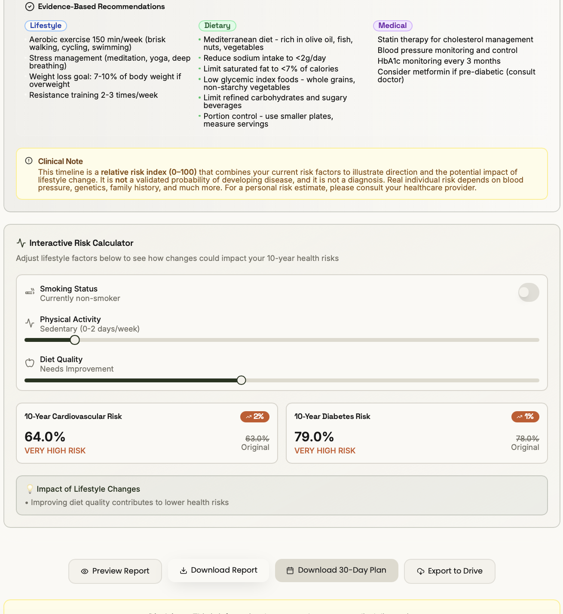
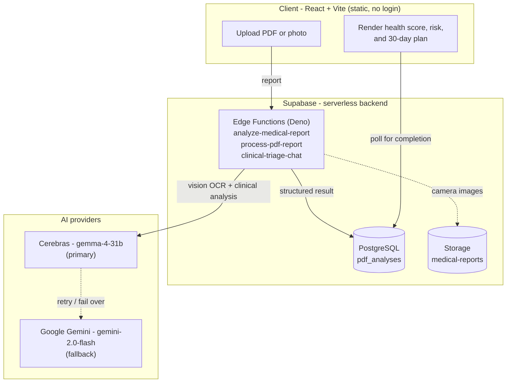

<div align="center">

# Diagassist

### Understand your medical reports

Diagassist turns a raw lab report into a clear, personalized health briefing. A user uploads a PDF or a phone photo of their blood test, and within seconds the app reads every value, explains what each one means in plain language, scores overall health, projects long-term risk, and produces a 30-day action plan.

Developed for **PredLabs Pvt. Ltd.**


</div>

<p align="center">
  
</p>

---

## Overview

Lab reports are written for clinicians, not patients. A page of numbers, units, and reference ranges tells most people very little about how they are actually doing. Diagassist closes that gap.

The user gives the app one thing: a lab report. From there it does the reading, the interpretation, and the follow-up. It extracts every parameter, flags the ones outside range, asks a short set of relevant symptom questions to add context, and returns a single, readable picture of the person's health, complete with a score, a ten-year risk outlook, and concrete next steps. No account is required, and nothing is stored after the analysis.

## What it does

- **Reads any report.** Accepts a PDF or a photo. A vision model performs OCR on every page and pulls out each test, value, unit, and reference range.
- **Explains it in plain language.** Each abnormal result is described in everyday terms, grouped into medical panels, with an overall "needs attention" verdict.
- **Scores your health.** A weighted 0-100 health score with a body-systems breakdown (metabolic, cardiovascular, kidney, liver, blood, endocrine), benchmarked to the user's age group.
- **Adds clinical context.** A short adaptive assessment asks symptom questions tailored to the findings, sharpening the interpretation.
- **Projects risk honestly.** Ten-year cardiovascular and diabetes trajectories, presented as a relative index rather than a false precision, with a clear "not a diagnosis" framing.
- **Gives an action plan.** A personalized 30-day roadmap of dietary, lifestyle, and follow-up steps, plus downloadable PDF reports.
- **Respects privacy.** Account-free and ephemeral by design; the user simply downloads their own copy.

## How it works

The experience is four steps, front to back.

| Step | Stage | What happens |
| --- | --- | --- |
| 01 | Upload | Secure PDF or photo upload |
| 02 | AI Analysis | Real-time reading of every parameter |
| 03 | Clinical Chat | Tailored symptom questions for context |
| 04 | Results | A comprehensive, readable health briefing |

<p align="center">
  
  
</p>

<p align="center">
  
  
</p>

<p align="center">
  
  
</p>

<p align="center">
  
</p>

## Tech stack

| Layer | Technology | Purpose |
| --- | --- | --- |
| Frontend | React 18, TypeScript, Vite | Single-page app, type safety, fast builds |
| Styling | Tailwind CSS, shadcn/ui | Design system and accessible components |
| Data and charts | TanStack Query, Recharts | Fetching and caching, risk visualizations |
| Documents | jsPDF | Client-side PDF report generation |
| Backend | Supabase: PostgreSQL, Edge Functions (Deno), Storage | Database, serverless API, file storage |
| AI, primary | Cerebras Inference (gemma-4-31b) | Vision OCR, medical analysis, and clinical chat |
| AI, fallback | Google Gemini (gemini-2.0-flash) | Automatic failover for reliability |
| Tooling | Supabase CLI, Git and GitHub | Schema migrations, function deploys, version control |

## Architecture

Diagassist is a static frontend backed by a serverless backend on Supabase. The browser never calls an AI provider directly; every model call runs inside a Supabase Edge Function, which keeps API keys off the client and lets the pipeline retry and fail over on the server side.



**Request flow.** The browser turns the report into page images and calls an Edge Function. The function runs a two-pass pipeline - a vision OCR pass that reads every value, then a clinical-grade analysis pass that structures and interprets them - and writes the result to a `pdf_analyses` row. Because analysis can outlast a single request, this is an asynchronous job: the function returns an id immediately, does the work in the background, and the frontend polls the row until it is complete, then renders everything on the client.

**Edge Functions (Deno).**

- `analyze-medical-report` - the PDF path: vision OCR plus the main clinical analysis.
- `process-pdf-report` - the camera path: structured extraction from photos via tool-calling.
- `clinical-triage-chat` - the adaptive symptom assessment that adds clinical context.
- `get-analysis-result` - result retrieval for polling.

**Reliability.** Every model call is wrapped in retry with exponential backoff, and if Cerebras is rate-limited or unavailable it fails over automatically to Google Gemini, so a single provider outage does not take the pipeline down.

**Privacy by design.** There is no authentication and no long-term storage of personal health data. Analyses are ephemeral job records, access is scoped to the anonymous role, and users simply download their own copy.

## Getting started

```bash
# Frontend
git clone https://github.com/zayedongit/diagassist-ai.git
cd diagassist-ai
npm install
cp .env.example .env        # add VITE_SUPABASE_URL and VITE_SUPABASE_PUBLISHABLE_KEY
npm run dev
```

```bash
# Backend (Supabase project)
supabase link --project-ref <your-project-ref>
supabase db push
supabase secrets set CEREBRAS_API_KEY=<key> GEMINI_API_KEY=<key>
supabase functions deploy analyze-medical-report --no-verify-jwt
supabase functions deploy process-pdf-report --no-verify-jwt
supabase functions deploy clinical-triage-chat --no-verify-jwt
supabase functions deploy get-analysis-result --no-verify-jwt
```

## Disclaimer

Diagassist is an informational tool, not a medical device. Its output is not a diagnosis and does not replace professional medical advice. Users should always consult a qualified healthcare provider about their results.

---

<div align="center">

Developed for **PredLabs Pvt. Ltd.**

</div>
