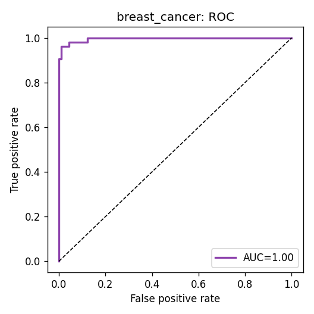
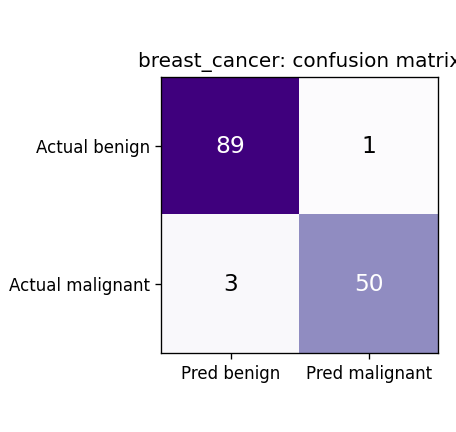
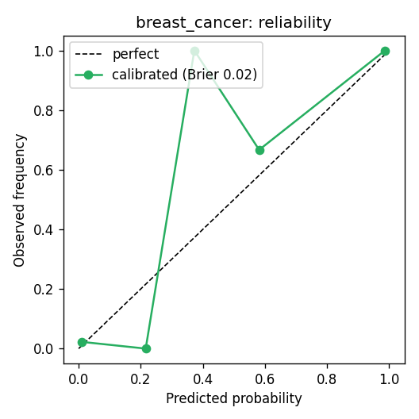
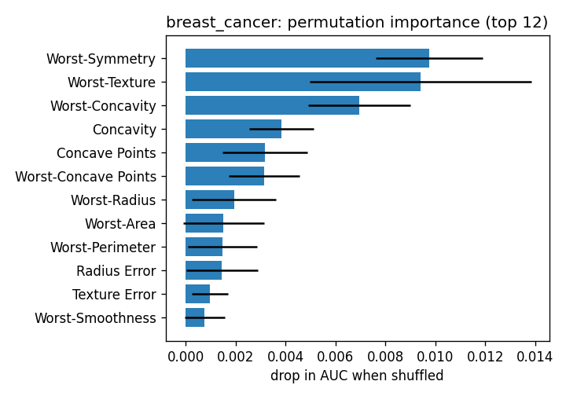

# Breast cancer classifier — results

**Task:** classification — detect a **malignant** tumour from fine-needle-aspirate
cell measurements.
**Dataset:** scikit-learn breast cancer Wisconsin (569 samples, 30 features; UCI /
Street et al. 1993).
**Model:** logistic regression (C tuned by CV) + Platt calibration.
**Purpose:** a standalone demonstration that the trainer registry generalizes to a
new disease with one loader entry. It is **not** wired into the lab-report UI because
its inputs are biopsy measurements, not blood tests.

## Metrics (held-out test set)

| metric | value |
| --- | --- |
| ROC-AUC | **0.996** |
| Cross-val AUC | **0.995 ± 0.004** |
| Accuracy | 0.97 |
| Brier score | 0.02 (excellent calibration) |

The top drivers (worst-symmetry, worst-texture, worst-concavity) match the clinical
intuition that irregular, textured, concave nuclei signal malignancy. See
`charts/INDEX.md` for a plain-language guide to every chart.
