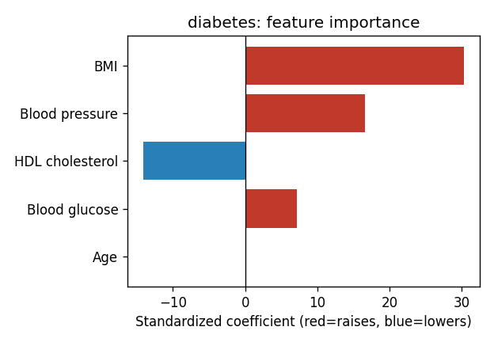
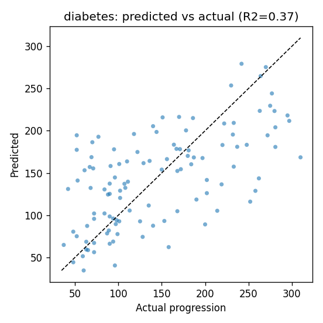

# Diabetes progression model — results

**Task:** regression — predict a diabetes disease-progression score one year after
baseline, from routine labs.
**Dataset:** scikit-learn *diabetes* dataset, 442 real patients (Efron, Hastie,
Johnstone & Tibshirani, 2004).
**Model shipped:** Ridge linear regression (standardized inputs).
**Split:** 331 train / 111 test, plus 5-fold cross-validation.

## Headline metrics (held-out test set)

| metric | value | meaning |
| --- | --- | --- |
| R² | **0.37** | explains 37% of the variation in progression |
| Cross-val R² | **0.41 ± 0.09** | stable across folds → not overfit |
| RMSE | **59.0** | typical error, vs **74.9** for a no-model baseline (~21% lower) |
| MAE | 46.6 | mean absolute error |

A random forest scored no better (R² 0.33), so the transparent linear model wins.

## What drives the estimate

Standardized coefficients (comparable across features):

| feature | effect | direction |
| --- | --- | --- |
| BMI | +30.3 | raises progression (strongest) |
| Blood pressure | +16.6 | raises |
| HDL cholesterol | −14.1 | **lowers** (protective) |
| Blood glucose | +7.2 | raises |
| Age | +0.0 | negligible here |

All clinically sensible: higher BMI, blood pressure, and glucose predict faster
progression; higher HDL ("good" cholesterol) predicts slower.

## Predicted vs actual

Points cluster around the diagonal (perfect prediction) with real scatter — an
honest R²≈0.37 model, not an overfit one claiming to be perfect.

## In the app

When a report yields at least two of the five inputs, DiagAssist shows a
*Diabetes progression — ML estimate* card: a 0–100 index (mapped across the
dataset's 5th–95th percentile of predictions), the top contributing labs, and the
model's provenance and validation numbers. Missing inputs fall back to population
averages, stated on the card. It is labelled a research/education estimate, not a
diagnosis.
